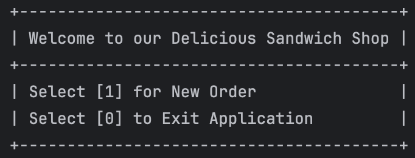
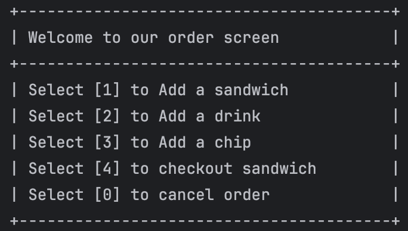
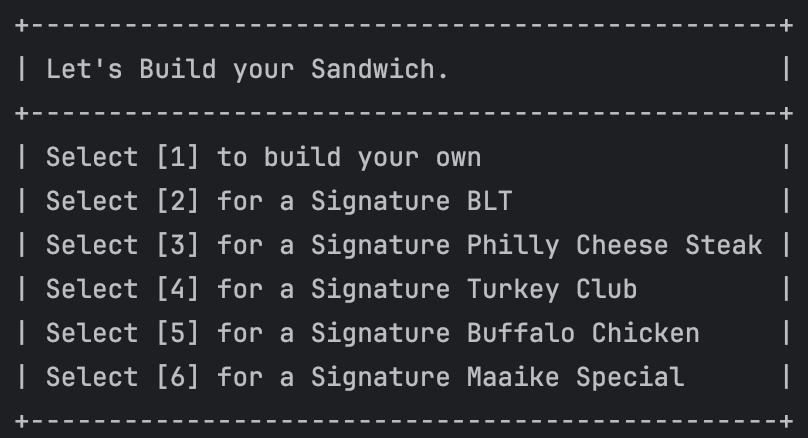
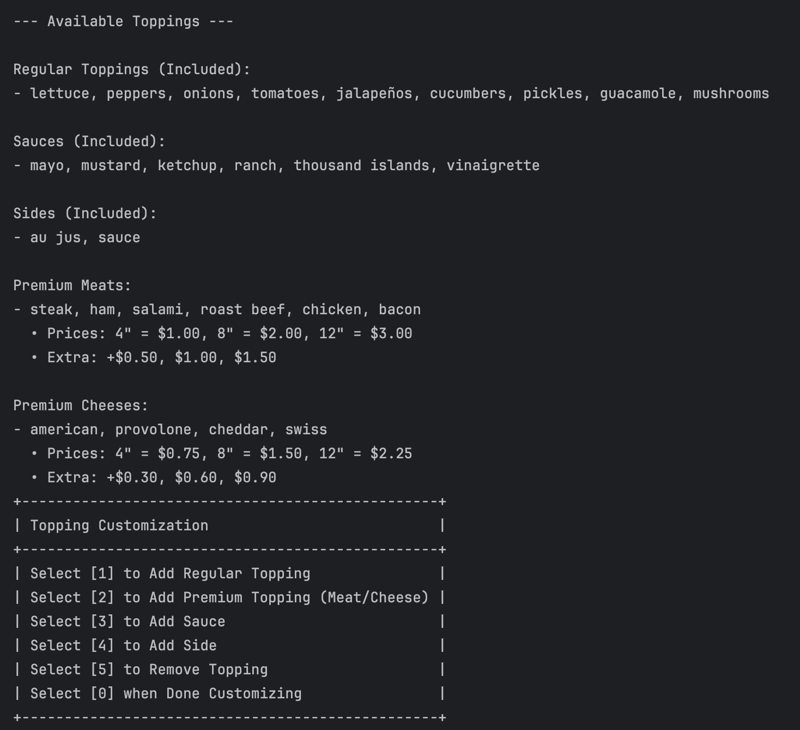
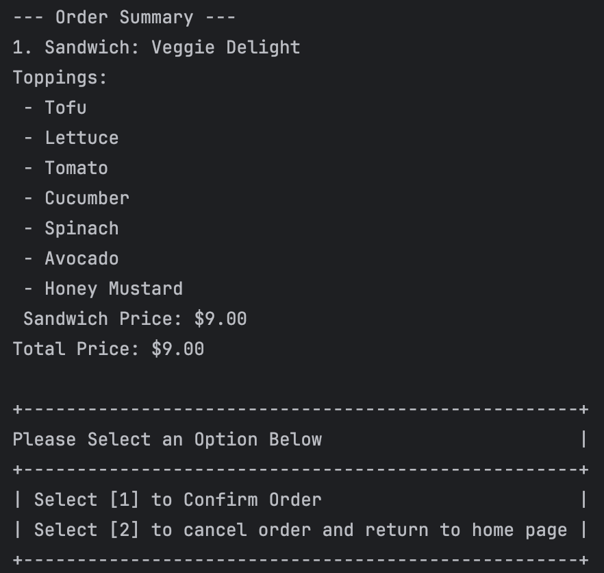

# Delicious Sandwich Shop CLI Application 

## Project Description 

A fully-featured command-line sandwich ordering application that allows customers
to build, customize, and order sandwiches, drinks, and chips — with receipts and 
pricing based on real-time selections.

## Table of Contents
<details>
<summary> Overview</summary>

- [Project Description](#project-description)
- [Features](#features)
- [Technologies Used](#technologies-used)
</details>

<details>
<summary> Getting Started</summary>

- [Installation](#installation)
- [Running the App](#running-the-app)
- [Folder Structure](#folder-structure)

</details>

<details>
<summary> Key Concepts</summary>

- [OOP Concepts](#oop-concepts)
- [Signature Sandwiches](#signature-sandwiches)

</details>

<details>
<summary> Testing</summary>

- [Unit Testing](#unit-testing)

</details>

<details>
<summary> Author</summary>

- [About Me](#about-me)

</details>

---

## Project Description

This capstone project simulates a real-world point-of-sale system for a sandwich shop. Users interact through a CLI to:

- Build custom sandwiches with bread, size, and toppings.
- Choose drinks and chips.
- View a receipt.
- Save order summaries to timestamped text files.

---

## Features

- Add Sandwich, Chips, and Drinks
- Customize toppings (meats, cheeses, sauces, veggies)
- Signature Sandwich templates
- Realistic pricing by size and topping
- Receipt file saved per order
- Clean CLI interaction
- Organized by OOP best practices

## Home Screen 
- Select [1] to place a new order 
- Select [0] to exit the application 

*Here is a image of my Home Screen*



## Order Screen
- Select [1] to Add a sandwich 
- Select [2] to add a drink 
- Select [3] to add a cup 
- Select [4] to checkout a sandwich
- Select [5] to cancel an order

*Here is a image of my Order Screen*



## Build Your sandwich 
- Option to build your sandwich
- Option to select Signature Sandwiches

*Here is a image of my Sandwich Screen*



## Customize Topping Screen
- Select [1] to Add a regular topping
- Select [2] to add a premium topping
- Select [3] to add a sauce
- Select [4] to add a side
- Select [5] to remove toppings
- Select [0] when done customizing

*Here is a image of my Topping Screen*


## Checkout Screen
- Contains an Order Summary 
- List of items selected 
- Price and Total Price of items selected
- Options to confirm or cancel order 

*Here is a image of my Checkout Screen*




---

## Technologies Used

- Java 24 (Oracle JDK)
- Maven for build management
- JUnit 5 for unit testing
- Git & GitHub for version control
- IntelliJ IDEA (Community Edition)

---

## Installation

1. Clone the repo:
   ```
   git clone https://github.com/your-username/delicious-sandwich-shop.git
   
2. Open in IntelliJ as a Maven project

3. Compile and run

4. Follow the on-screen prompts to build your order!

## Folder Structure

[Screenshot of my folder structure](#)


 ## OOP Concepts
Abstraction: MenuItem and Topping are abstract superclasses

Inheritance: SignatureSandwich, PremiumTopping extend base classes

Polymorphism: Receipt uses shared interfaces for all MenuItems

Encapsulation: Order contains item logic and total calculations

 ## Signature Sandwiches
Predefined sandwiches available:
- BLT
- Philly Cheese Steak
- Buffalo Chicken
- Turkey Club
- Veggie Delight
- Maaike's Special

These extend the Signature Sandwich class and can be customized further!

## Unit Testing
JUnit tests exist for:
- SandwichTest
- DrinkTest
- ChipTest
- OrderTest
- ToppingTest

## Interesting code highlight 

```java
public double getPrice(String sandwichSize) {
   //Validate whether category is meat or cheese
   if (!toppingCategory.equalsIgnoreCase("meat") && !toppingCategory.equalsIgnoreCase("cheese")){
      throw new IllegalArgumentException("Invalid topping category: " + toppingCategory +
              " (must be 'meat' or 'cheese')");
   }
   //Remove any extra spaces
   sandwichSize = sandwichSize.trim();

   //Validate the right size
   if (!sandwichSize.equals("4") && !sandwichSize.equals("8") && !sandwichSize.equals("12")){
      throw new IllegalArgumentException("Invalid sandwich size: " + sandwichSize +
              " (must be '4', '8', or '12')");
   }

   //Calculate price based on sandwich size and topping category
   if (toppingCategory.equalsIgnoreCase("meat")){
      //Meat price table
      if(sandwichSize.equalsIgnoreCase("4")){
         if(extraTopping){
            return 1.50;
         }
         else {
            return 1.00;
         }
      } else if (sandwichSize.equalsIgnoreCase("8")) {
         if(extraTopping){
            return 3.00;
         }
         else {
            return 2.00;
         }
      } else {
         if (extraTopping){
            return 4.50;
         }
         else {
            return 3.00;
         }
      }
      //If category is cheese
   } else if (toppingCategory.equalsIgnoreCase("cheese")) {
      //Cheese price table
      if(sandwichSize.equalsIgnoreCase("4")){
         if(extraTopping){
            return 1.05;
         }
         else {
            return 0.75;
         }
      } else if (sandwichSize.equalsIgnoreCase("8")) {
         if(extraTopping){
            return 2.10;
         }
         else {
            return 1.50;
         }
      } else {
         if(extraTopping){
            return 3.15;
         }
         else {
            return 2.25;
         }
      }
   }
   //So compiler can work, avoid java error
   return 0.0;
}
```

### Why it’s my most interesting code

- **Defensive Validation:**
Checks the topping category and sandwich size immediately, throwing clear exceptions on invalid inputs so errors are caught early.

- **Input Sanitization:**
Uses .trim() to strip stray whitespace before comparisons, preventing subtle bugs.

- **Clear, Table-Driven Logic:**
Implements separate price tables for “meat” and “cheese”, with concise handling of extra-portion surcharges.

- **Single Responsibility:**
This method only calculates price based on its inputs; it doesn’t touch UI, order management, or file I/O.

- **Readability & Maintainability:**
Well-commented, flat structure (no deep nesting) makes it easy to extend with new sizes or categories.on**, **error handling**, and **business-rule implementation** in under ~30 lines of code.


## Author: 
Olumide Kolawole


